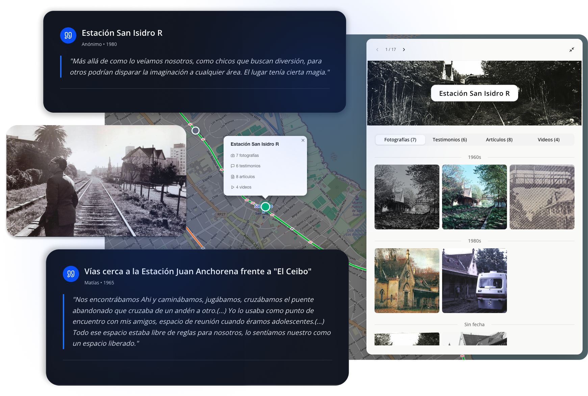

<div align="center">
  
  
  # Memorias del Tren del Bajo
  
  **Visit the project:** [memoriastrendelbajo.com](https://memoriastrendelbajo.com)
  
  
</div>

---

## About This Project

This website serves as a digital memorial and historical archive dedicated to preserving the collective memory of the Tren del Bajo, also known as "La Vía Muerta" (The Dead Track). Through an interactive mapping experience, we aim to document and share the stories, testimonies, and photographic evidence that tell the history of this important railway infrastructure in Buenos Aires.

## Mission

The Tren del Bajo represents more than abandoned railway tracks—it embodies decades of urban history, social transformation, and community memory. This project seeks to:

- **Preserve Historical Memory**: Safeguard the stories and testimonies of those who lived, worked, and were impacted by the Tren del Bajo before they are lost to time.

- **Document Physical Heritage**: Create a comprehensive visual and textual record of the railway's infrastructure, mapping its route and documenting its current state.

- **Foster Community Engagement**: Provide a platform where community members can explore and understand the historical significance of this urban space.

- **Support Historical Research**: Offer researchers, urban planners, and historians a structured database of geolocated historical information.

## What You'll Find

The website presents an interactive map-based experience where visitors can:

- Explore geolocated historical points along the railway route
- View historical and contemporary photographs documenting the infrastructure
- Read personal testimonies and accounts from community members
- Navigate chronologically through the railway's history
- Access multimedia content including videos and detailed narratives

## Technical Overview

This platform is built with modern web technologies to ensure a responsive, accessible, and performant experience across all devices. The application integrates:

- Interactive mapping visualization for spatial navigation
- Structured historical data organized by geographic location
- High-quality image galleries with detailed metadata
- Responsive design optimized for mobile and desktop viewing

## Data Sources

The historical content presented on this website has been compiled through:

- Archival research and historical documentation
- Community testimony collection
- Photographic documentation initiatives
- Collaboration with local historians and residents

## Contact & Contributions

This project is an ongoing effort to preserve and share historical memory. If you have stories, photographs, or information related to the Tren del Bajo that you would like to contribute, we welcome your participation in this collective memory project.

---

## Development

### Getting Started

```bash
# Install dependencies
npm install

# Run development server
npm run dev

# Build for production
npm run build

# Start production server
npm start
```

### Technology Stack

- **Framework**: Next.js 15 with React 19
- **Language**: TypeScript
- **Styling**: Tailwind CSS
- **Mapping**: Leaflet & MapLibre GL
- **UI Components**: Shadcn components and Radix UI primitives
- **Data Format**: CSV-based historical records


---

## License

This project is dedicated to preserving public historical memory. All historical content and testimonies are presented for educational and commemorative purposes.

---

**La Vía Muerta - Huella Histórica**  
*Preserving the memory of the Tren del Bajo for future generations.*

